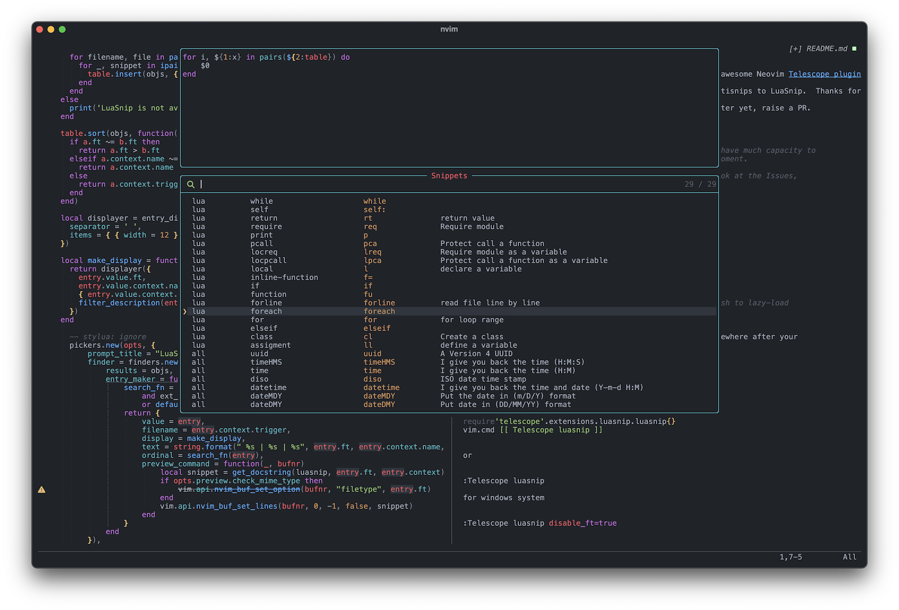

# telescope-luasnip

This plugin adds a [LuaSnip](https://github.com/L3MON4D3/LuaSnip) snippet picker to the already-awesome Neovim [Telescope plugin](https://github.com/nvim-telescope/telescope.nvim).

This is a port of [fhill2/telescope-ultisnips.nvim](https://github.com/fhill2/telescope-ultisnips.nvim) from Ultisnips to LuaSnip.  Thanks for the simple great idea!

**NOTE: This plugin is fairly new. If you find something wrong, please raise an issue or better yet, raise a PR.**



## Requirements

- [LuaSnip](https://github.com/L3MON4D3/LuaSnip) (required)
- [telescope.nvim](https://github.com/nvim-telescope/telescope.nvim) (required)

## Setup

Install the plugin using your favourite package manager.

```lua
use {
    "benfowler/telescope-luasnip.nvim",
    module = "telescope._extensions.luasnip",  -- if you wish to lazy-load
}
```

Then, you need to tell Telescope about this extension somewhere after your
`require('telescope').setup()`, by calling:

```lua
require('telescope').load_extension('luasnip')
```

## Usage

```lua
require'telescope'.extensions.luasnip.luasnip{}
vim.cmd [[ Telescope luasnip ]]
```

or

```vim
:Telescope luasnip
```
for windows system

```vim
:Telescope luasnip disable_ft=true
```

## Configuration

This Telescope plugin works fine as-is, and requires no further configuration.

However, if you want, you can customise its search behaviour if you wish:

```lua
local lst = require('telescope').extensions.luasnip
local luasnip = require('luasnip')

require('telescope').setup {
    extensions = {
        ...
        luasnip = {
                search = function(entry)
                        return lst.filter_null(entry.context.trigger) .. " " ..
                               lst.filter_null(entry.context.name) .. " " ..
                               entry.ft .. " " ..
                               lst.filter_description(entry.context.name, entry.context.description) ..
                               lst.get_docstring(luasnip, entry.ft, entry.context)[1]
                end
        },
       ...
    }
}
```

## Help!

Is there something not quite right or could be improved?  Log an issue with a
minimal reproduction, or better yet, raise a PR.

